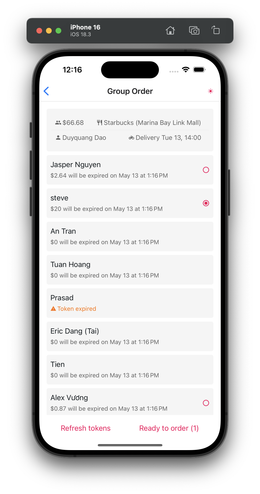

# FoodPanda Group Order Manager 👋

|Light Mode|Dark Mode|
|---|---|
|||

This is an [Expo](https://expo.dev) app that helps manage FoodPanda group orders by letting users share authentication tokens and track allowances across different user groups.

## Get started

1. Install dependencies

   ```bash
   npm install
   ```

2. Start the app

   ```bash
   npx expo start
   ```

In the output, you'll find options to open the app in:

- [development build](https://docs.expo.dev/develop/development-builds/introduction/)
- [Android emulator](https://docs.expo.dev/workflow/android-studio-emulator/)
- [iOS simulator](https://docs.expo.dev/workflow/ios-simulator/)
- [Expo Go](https://expo.dev/go)

## App Features

- **Group Selection**: Choose between different user groups (vn, coffee-gang, dex)
- **Order Processing**: Enter FoodPanda group order links or order IDs
- **User Management**: View and select users with valid authentication tokens
- **Allowance Tracking**: Check available meal allowances for each user
- **Token Refresh**: Automatically refresh expired authentication tokens

This project uses [Expo Router](https://docs.expo.dev/router/introduction) for file-based routing.

## Project Structure

- **app/** - Main application screens using file-based routing
  - `index.tsx` - Home screen with order entry and group selection
  - `list.tsx` - List of users with their allowances and authentication status
  - `_layout.tsx` - Root layout with navigation stack
- **components/** - Reusable UI components
  - `ThemedText.tsx`, `ThemedView.tsx` - Theme-aware base components
  - **ui/** - Specific UI components like UserCard, GroupHeader, etc.
- **fpServices/** - FoodPanda API integration
  - `fpModels.ts` - TypeScript interfaces for API data
  - `fpServices.ts` - API service functions
- **hooks/** - Custom React hooks for theming
- **constants/** - Application constants including color schemes
- **assets/** - Images and fonts

## How It Works

1. Users select their group from the segmented control
2. They enter either a FoodPanda group order link or an order ID
3. The app extracts the order ID and fetches user data from the backend
4. Users can view all available accounts with valid authentication tokens
5. For each account, the app displays the available meal allowance
6. Users can refresh tokens if they're expired

## Development

### Running the App

After installing dependencies, start the development server:

```bash
npx expo start
```

### Testing

To verify the integration with FoodPanda's API, try entering a group order link in the text field or directly input an order ID.

### Building for Production

To create a production build:

```bash
eas build --platform ios
# or
eas build --platform android
```

### Reset Project (For Contributors)

To reset the project to a clean state:

```bash
npm run reset-project
```

This command moves the starter code to the **app-example** directory and creates a blank **app** directory.

## Learn more

To learn more about developing your project with Expo, look at the following resources:

- [Expo documentation](https://docs.expo.dev/): Learn fundamentals, or go into advanced topics with our [guides](https://docs.expo.dev/guides).
- [Learn Expo tutorial](https://docs.expo.dev/tutorial/introduction/): Follow a step-by-step tutorial where you'll create a project that runs on Android, iOS, and the web.

## Technical Details

### API Integration

The app interacts with two main API endpoints:
- FoodPanda API (`sg.fd-api.com`) for order metadata and user allowance information
- Backend service (`stevedao.xyz/fp`) for user authentication and token refresh

### Authentication

The app uses JWT tokens for authentication with FoodPanda's API. Tokens have an expiry time and can be refreshed when needed.

### Dependencies

Key dependencies include:
- `expo-router` for navigation and routing
- `jwt-decode` for handling authentication tokens
- `@react-native-segmented-control/segmented-control` for group selection UI

## Resources

- [Expo Documentation](https://docs.expo.dev/)
- [React Native Documentation](https://reactnative.dev/)
- [Expo Router Documentation](https://docs.expo.dev/routing/introduction/)
